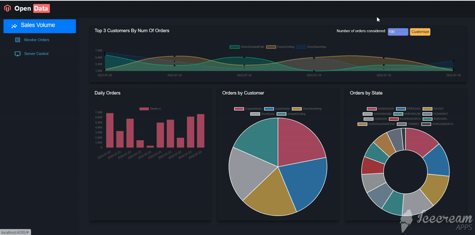

# OpenData - Data Visualization using Angular and ASP.NET Core Web-Api 📈📊🔓

Welcome to OpenData! I built this application because I wanted to build the application using the Angular and ASP.NET Core Web-Api frameworks, and so I did it!. I hope that you enjoy playing around with this application just as much as I enjoyed building it.

## Acknowledgments 🧡

Thank you very much to everyone who helped me to build this app by providing an awesome tutorials, libraries and amazing APIs.
Because of you, the programming world is becoming much more interesting and exciting !

`Wes Doyle` - [https://www.youtube.com/playlist?list=PL3_YUnRN3Uhh5vywsT75JbQsB8eBpwm1y](https://www.youtube.com/playlist?list=PL3_YUnRN3Uhh5vywsT75JbQsB8eBpwm1y)

## Contributing 🌟

Contributions are what make the open source community such an amazing place to learn, inspire, and create. Any contributions you make are **greatly appreciated**.

If you have a suggestion that would make this better, please fork the repo and create a pull request. You can also simply open an issue with the tag "enhancement".
Don't forget to give the project a star! Thanks again!

1. Fork the Project
2. Create your Feature Branch (`git checkout -b feature/AmazingFeature`)
3. Commit your Changes (`git commit -m 'Add some AmazingFeature'`)
4. Push to the Branch (`git push origin feature/AmazingFeature`)
5. Open a Pull Request
6. 
## Additional info (Warranty,DMCA) ℹ️

The Software is provided "as is", without warranty of any kind, express or implied, including but not limited to the warranties of merchantability, fitness for a particular purpose and noninfringement. In no event shall the authors or copyright holders be liable for any claim, damages or other liability, whether in an action of contract, tort or otherwise, arising from, out of or in connection with the Software or the use or other dealings in the Software.

The project may contain some third-party copyrighted materials.
If your copyrighted material including but not limited to article text, program code, images, photos, videos, page layout/style has been used illegally, and you want this material to be removed or to be listed with your credentials in the 'Acknowledgments' section of this readme file, please send the written infringement notice with all the related information to the following email address `nodirbeknabiev98@gmail.com`. Please, allow 4-5 business days for an email response.
Note that I always strive to give a proper kudos to everyone whose work somehow helped me with the project realization because I do respect the work of others. Hence, a copyright infringement,if it happened, was an unintentional action.

## Copyright ©️

All rights reserved. `Nodirbek Nabiev` is the author of this project and the copyright holder of all the content of this project, unless explicitly indicated otherwise. 

## Contact 📇

Author: Nodirbek Nabiev 
Email: nodirbeknabiev98@gmail.com

Project Link: [https://github.com/nodirbeknabiev98/OpenData](https://github.com/nodirbeknabiev98/OpenData)

(<a href="#readme-top">Back To ⬆️</a>)

